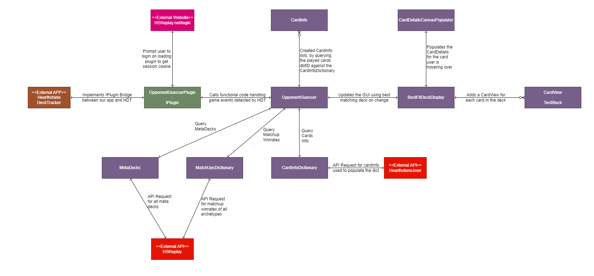

# Development Notes

[Back To ReadMe](../README.md)

## Diagrams

### Entity Relationship Diagram

Diagram explaining the relationships between the different classes and their properties

## Dependencies
- For this project, currently it also requires:
  - WebDriver.dll
  - WebDriver.Support.dll
  - SeleniumExtras.WaitHelpers.dll
  - chromedriver.exe
- See [Adding Dependencies](#adding-dependencies) for how to add these to the project

## Useful notes for further development

### Testing

- Build the project
- Navigate to: '.\HDT_OpponentGuesser\bin\Debug\'
- Find the 'HDT_OpponentGuesser.dll' inside (and the other dlls it requires (see [Dependencies](#dependencies))) 
- Close Hearthstone Deck Tracker
- Copy over the .dll to '%AppData%\HearthstoneDeckTracker\Plugins'
- Relaunch Hearthstone Deck Tracker

### Creating GUI Elements

- The GUI elements in this project are WPF UserControls
- So to add a new one, simply right click on project and select Add -> User Control (WPF) and name it
    - This will create a .xaml (frontend) and .xaml.cs (backend) file for you
 
## Possible Future Directions

- Perhaps see if a more efficient method can be found for gathering session cookie than the selenium method currently being used
- Capturing and storing stats of players decks vs different deck archetypes
- Perhaps also using this to find best fit deck for players deck to display their best mulligan choices at game start?
- Currently only supports Standard_Ranked; could be expanded to get the players game mode on game start and modify the API call to pass that in, instead of defaulting to Standard_Ranked
- Potentially also display the cards which don't match the predicted deck in the decklist, as was in the original design
    - Didn't end up being incorporated because I thought it could clutter it too much and wasn't too useful to display

## Debugging + Common Issues

### Finding Logs
Logs are stored here: ('%AppData%\HearthstoneDeckTracker\Logs\')

### Adding Dependencies

- Missing dependencies in HSDT (required DLL's) results in:
  - Error (in log): "The located assembly's manifest definition does not match the assembly reference."

- Just use Nuget to download the specific **version** it is wanting in the reference, then **copy that dll from the Debug folder to the %AppData%\HearthstoneDeckTracker\Plugins\ folder**
  - Can either be done via:
    - Package Manager Console (harder), or 
    - In VS by right clicking on the project and selecting "Manage Nuget Packages" (easier)
  - To find the version, right click on the .dll and select *properties*, then go to *details* tab.

## Useful Links

- [Creating a Plugin](https://github.com/HearthSim/Hearthstone-Deck-Tracker/wiki/Creating-Plugins)
- [Basic Plugin Tutorial](https://github.com/HearthSim/Hearthstone-Deck-Tracker/wiki/Basic-plugin-creation-tutorial)
  - [Where to Find The Logs](https://github.com/HearthSim/Hearthstone-Deck-Tracker/wiki/Creating-Plugins#basics-where-to-start)
