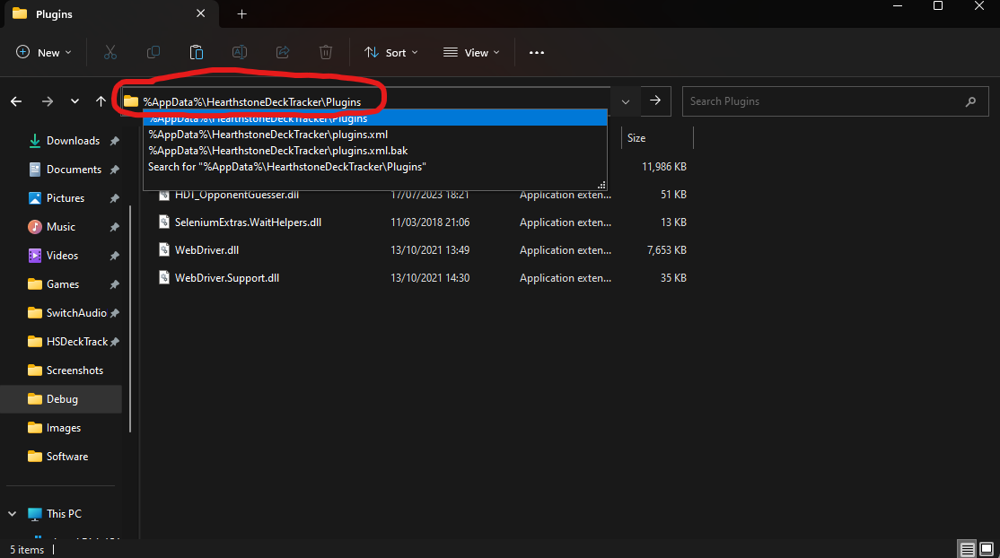

# Hearthstone DeckTracker - Opponent Guesser Plugin

NOTE: currently this plugin only supports Standard_Ranked, and will not query for Wild, Twist, or other game modes decks.

## Explanation

## Video Demonstration

Click To See Video Presentation

## How to use the plugin

[In Depth Text Explanation Here](./Documents/Manual.md)

## Installation instructions

1. Download the HDT_OpponentGuesser.zip from the latest release
2. Extract the HDT_OpponentGuesser.zips contents to "*%AppData%\HearthstoneDeckTracker\Plugins*"
   1. (Launch file explorer + copy this path into the address bar)
   
3. Restart HDT

## Suggestions

- If you have any suggestions (bugfixes, improvements, additional features, etc.), please feel free to open an issue on this repo and/or reach out to me and these will be considered for future updates.

## Contributions

- If you would like to contribute, please feel free to open a pull request on this repo
- [Developer Docs](./Documents/DeveloperDocs.md)
