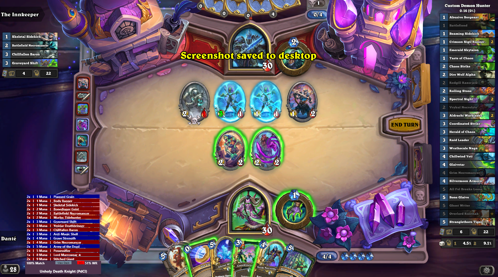
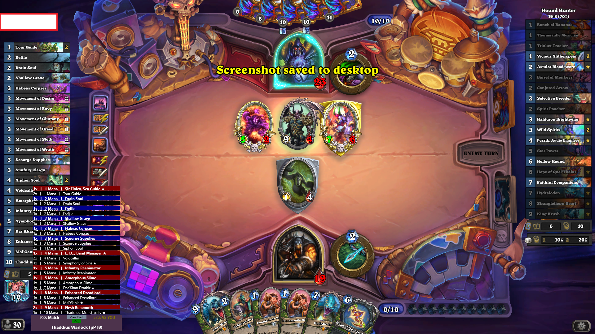

# Hearthstone DeckTracker - Opponent Guesser Plugin

NOTE: currently this plugin only supports Standard_Ranked, and will not query for Wild, Twist, or other game modes decks.

## Explanation of the plugin

<!-- Table with 1 row with 2 columns -->
|  |  |
|----|----|
| Played Cards Toggle Off | Played Cards Toggle On |

- Plugin appears as grey box in the bottom left of the screen that updates everytime the opponent plays a card.
- If there is a meta deck on HSReplay that matches at least 50% of the played cards, it will populate that box with:
  - The name of the decks archetype
  - The first few characters of the ID (to differentiate decklists of the same archetype)
  - The percentage match this deck is against the opponents played cards
  - The winrate of the deck
    - "Vs You" - if their deck has a record in its matchups for the best fit to your deck
    - "Vs All" - if not, uses the overall winrate of the deck
    - Colour scaled: red (bad) = high winrates, green (good) = low winrates
  - Toggleable button under ViewDeck button to toggle if you want to see the cards predicted as being left in the deck vs the predicted decklist as a whole:
    - If the button is red, it will show the complete decklist we are predicting opponent is using
    - If the button is green, it will display the count of each card predicted to be left in the deck + played cards blacked out
  - ViewDeck Button
    - On click, will open the HSReplay page for the opponents deck in your default browser
    - On hover, will display the decklist of the deck in game
      - Cards are colour coded for easy viewing:
        - Red = Minion
        - Blue = Spell
        - Yellow = Weapon
        - Green = Location
        - Magenta = Secret
        - Star next to name = Legendary
        - Black = Already Played Card (if toggle button is green)
    - Hovering over a card in the decklist will display that cards details
- If there isn't a match, it will instead display "No deck found above 50% match"

## Installation instructions

1. Download the HDT_OpponentGuesser.zip from the latest release
2. Extract the HDT_OpponentGuesser.dll from the zip folder to %AppData%\HearthstoneDeckTracker\Plugins
3. Restart HDT

## Suggestions

- If you have any suggestions (bugfixes, improvements, additional features, etc.), please feel free to open an issue on this repo and/or reach out to me and these will be considered for future updates.

## Contributions

- If you would like to contribute, please feel free to open a pull request on this repo
- [Developer Docs](./Documents/DeveloperDocs.md)
