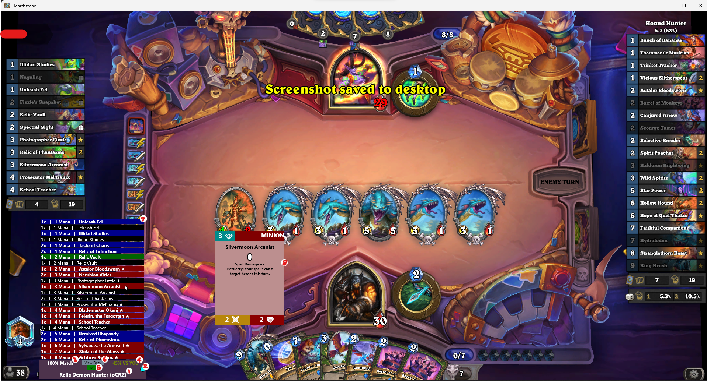

# Hearthstone DeckTracker - Opponent Guesser Plugin

NOTE: currently this plugin only supports Standard_Ranked, and will not query for Wild, Twist, or other game modes decks.

## Explanation of the plugin

### On Launch
- Upon loading the plugin a Chrome instance will be launched prompting you to login to hsreplay. If you own a premium account and wish to see data from rank Platinum and above, you must login. Else you do not own premium or are ranked Gold and below, you can close the browser without logging in.

### In Game
<!-- Table with 1 row with 2 columns -->
 | |
|----|
| Screenshot of plugin in action  |

- Plugin appears as grey box in the bottom left of the screen that updates everytime the opponent plays a card.
- If Plugin cannot find a match above 50% with a meta deck on hsreplay.net, the box will be empty besides a message saying "No Match"
- Once a match has been found, the plugin will update with the following information shown in the screenshot:
1. **The name of the decks archetype** and the first few characters of the ID (to differentiate decklists of the same archetype)
2. A coloured indicator of the **rank from which this data has been gathered**. If you logged in when prompted + own a premium account it can go up to Legend, otherwise it will be capped at Gold.
   1. Bronze = Brown
   2. Silver = Grey
   3. Gold = Yellow
   4. Platinum = Pale Blue
   5. Diamond = Cyan
   6. Legend = Orange
3. The **percentage match** this deck is against the opponents played cards
4. The **winrate** of the deck
   1. "Vs You" - if their deck has a record in its matchups for the best fit to your deck
   2. "Vs All" - if not, uses the overall winrate of the deck
   3. Colour scaled: red (bad) = high winrates, green (good) = low winrates
5. **Toggleable button** for if you want to see the complete predicted decklist, or the list of cards predicted to be left in the deck (removing cards already played)
   1. Button is red = complete decklist
   2. Button is green (recommended) = played cards blacked out
6. **ViewDeck button**
   1. On click, will open the HSReplay page for the opponents deck in your default browser
   2. On hover, will display the decklist of the deck in game
7. **Cardlist** for the predicted deck
   1. Cards are colour coded for easy viewing:
      1. Red = Minion
      2. Blue = Spell
      3. Yellow = Weapon
      4. Green = Location
      5. Magenta = Secret
      6. Star next to name = Legendary
      7. Black = Already Played Card (if toggle button is green)
   2. Hovering over a card in the decklist will display that cards details
8. **Card Details**, only shown if you hover over a card in the decklist

## Installation instructions

1. Download the HDT_OpponentGuesser.zip from the latest release
2. Extract the HDT_OpponentGuesser.dll from the zip folder to %AppData%\HearthstoneDeckTracker\Plugins
3. Restart HDT

## Suggestions

- If you have any suggestions (bugfixes, improvements, additional features, etc.), please feel free to open an issue on this repo and/or reach out to me and these will be considered for future updates.

## Contributions

- If you would like to contribute, please feel free to open a pull request on this repo
- [Developer Docs](./Documents/DeveloperDocs.md)
